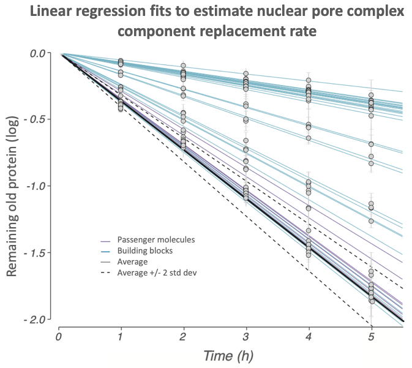
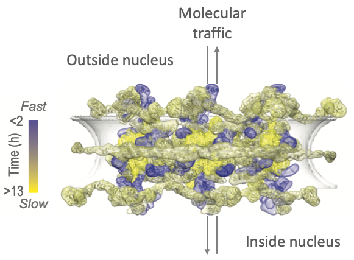

**Protein analysis pipeline for studying molecular machines**

**Motivation and background**

Keeping the cells in our bodies ticking along is the task of tiny
molecular machines, mostly composed of proteins. Take the nuclear pore
complex, for example. This nanomachine sits in the nuclear membrane of every
cell. Well, every cell that has a nucleus, that is. DNA, the genetic
blueprint of our very own being, is stored in the nucleus. It sounds
like an important place to protect, isn\'t it? That is exactly what the
nuclear pore complex does! It is the gatekeeper that ensures selective
passage of "authorized worker" molecules in and out of the nucleus. 

The goal of my thesis project was to engineer a novel approach for
studying the composition of the nuclear pore complex. Many years, blood,
sweat, and tears later I (with help of amazing colleagues and mentors)
worked out the cell biology, genetics, biochemistry, and mass
spectrometry experiments necessary to gather the required data... Only
to discover that the amount of data exceeded my capacity to analyze it
manually. That is when I discovered Python. Now I don't remember ever
analyzing data without it:)

The protein analysis pipeline published here automates the analysis of
mass spectrometry data, including filtering contaminants, calculating
summary statistics eliminating outliers, fitting a linear regression
model to time-course data and evaluating the goodness of fit. A sample
analysis is plotted below.

**Main findings**

The study identified a whole range of building block mobility: some are
permanent residents and rarely leave the nuclear pore complex, while
others are promiscuous and rapidly change hands (or nuclear pore
complexes as it were). Below is a heatmap of the relative mobility of
building blocks within the nuclear pore complex structure.

So, what happens if one of those stable building blocks is damaged? To
our amazement, we discovered that those subunits can be (forcefully)
removed by another molecular machine, the proteasome. Moreover, the
resulting gap is slowly but surely filled with fresh building blocks.
That is an essential resilience mechanism for a macromolecular machine
performing as crucial a task as guarding our genetic information.

If you would like to read the whole process here is a link to my thesis:

https://digitalcommons.rockefeller.edu/student\_theses\_and\_dissertations/301/

My work has also been turned into a manuscript (unpublished figures
presented here); I will provide a link as soon as the work is published.
